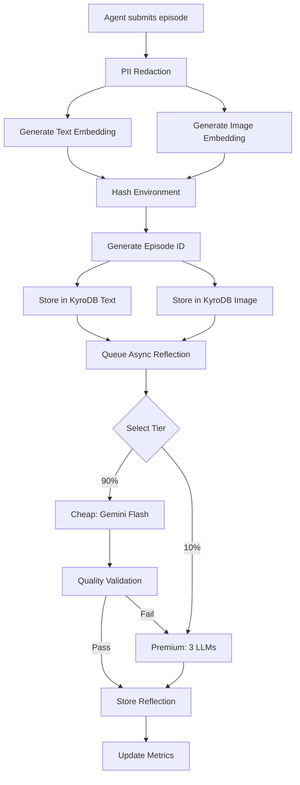

# Episodic Memory: Data Storage Architecture

**What We Capture and Store When a Failure Happens**

---

## 📋 Data Captured in `EpisodeCreate`

When an agent experiences a failure, the system captures comprehensive context to enable intelligent learning and retrieval.

### 1. Core Failure Context

```python
goal: str                    # What the agent was trying to accomplish
error_trace: str             # Full error message/stack trace
error_class: ErrorClass      # Category (configuration, network, permission, etc.)
severity: int                # 1=critical, 5=minor
```

**Example**:
```python
{
    "goal": "Deploy application to production",
    "error_trace": "OOMKilled: Container exceeded memory limit\nPod status: Failed",
    "error_class": "resource_error",
    "severity": 2
}
```

---

### 2. Execution Trace

```python
tool_chain: list[str]        # Tools used in sequence
actions_taken: list[str]     # Specific actions executed before failure
```

**Example**:
```python
{
    "tool_chain": ["docker", "kubectl", "helm"],
    "actions_taken": [
        "docker build -t myapp:latest .",
        "docker push myapp:latest",
        "kubectl apply -f deployment.yaml"
    ]
}
```

---

### 3. Code Context

```python
code_state_diff: Optional[str]  # Git diff or code changes leading to the issue
```

**Storage**: Stored as **text/string** in KyroDB metadata

**Example**:
```diff
--- a/deployment.yaml
+++ b/deployment.yaml
@@ -10,7 +10,7 @@
     spec:
       containers:
       - name: app
-        memory: "256Mi"
+        memory: "512Mi"
```

---

### 4. Environment Context

```python
environment_info: dict[str, Any]  # OS, versions, configuration, etc.
```

**Storage**: Serialized as **JSON** in KyroDB metadata

**Example**:
```python
{
    "os": "Linux",
    "os_version": "Ubuntu 22.04",
    "docker_version": "20.10.7",
    "kubernetes_version": "1.27.3",
    "python_version": "3.11.4",
    "memory_total_gb": 8
}
```

---

### 5. Visual Context (Screenshots) 🖼️

```python
screenshot_path: Optional[str]  # Path to error screenshot
```

#### How Images Are Stored:

| Component | Storage Method | Details |
|-----------|---------------|---------|
| **Original Image** | Filesystem | File remains on disk, **not uploaded** to KyroDB |
| **File Path** | KyroDB Metadata | Stored as string reference |
| **Image Embedding** | KyroDB Image Instance | 512-dimensional CLIP vector |

**Processing Flow**:
```python
# 1. Image stays on filesystem
screenshot_path = "/home/user/errors/deployment_error.png"

# 2. Generate CLIP embedding (512-dim vector)
image_embedding = embedding_service.embed_image(screenshot_path)

# 3. Store embedding in KyroDB image instance
kyrodb.insert(embedding=image_embedding, metadata={"screenshot_path": screenshot_path})
```

**Search Capability**: Multi-modal search finds episodes with **visually similar** error screens!

---

### 6. Resolution Information (Optional Learning)

```python
resolution: Optional[str]               # How the failure was eventually fixed
time_to_resolve_seconds: Optional[int]  # Time taken to resolve
```

**Example**:
```python
{
    "resolution": "Increased memory limit from 256Mi to 512Mi in deployment.yaml",
    "time_to_resolve_seconds": 1800  # 30 minutes
}
```

---

### 7. Metadata & Classification

```python
tags: list[str]        # Custom tags for organization
customer_id: str       # Multi-tenant isolation (extracted from API key)
```

**Example**:
```python
{
    "tags": ["production", "kubernetes", "memory", "urgent"],
    "customer_id": "customer_abc123"  # Set by API key, not user input
}
```

---

## 🧠 Generated Data (After Ingestion)

### 8. LLM Reflection (Multi-Perspective Analysis)

```python
reflection: Reflection
  ├─ root_cause: str                 # What actually caused the failure
  ├─ preconditions: list[str]        # When does this pattern apply?
  ├─ resolution_strategy: str        # Step-by-step fix instructions
  ├─ environment_factors: list[str]  # Relevant OS/tool versions
  ├─ affected_components: list[str]  # System components involved
  ├─ generalization_score: float     # 0=very specific, 1=universal pattern
  ├─ confidence_score: float         # LLM confidence in analysis
  ├─ consensus: ReflectionConsensus  # Multi-LLM agreement (if premium)
  ├─ cost_usd: float                # LLM generation cost
  └─ tier: str                      # cheap/cached/premium (Phase 5)
```

#### Reflection Tiers (Phase 5 - Cost Optimization)

| Tier | Model | Cost | Usage | When Used |
|------|-------|------|-------|-----------|
| **CHEAP** | OpenRouter (cheap model) | ~$0.0003 | 90% | Normal errors |
| **CACHED** | Cluster template | $0.0000 | Future (Phase 6) | Seen before |
| **PREMIUM** | Multi-perspective (2 LLMs) | ~$0.0500 | 10% | Critical errors |

**How It's Generated**:

**Cheap Tier (90%)**:
```python
# Single OpenRouter call with cheap model
reflection = await openrouter.generate(episode, model="cheap")
# Quality validated: confidence >= 0.6
# Auto-fallback to premium if quality too low
```

**Premium Tier (10%)**:
```python
# Parallel calls to 2 LLMs via OpenRouter
perspectives = await asyncio.gather(
    openrouter.analyze(episode, model="consensus_1"),
    openrouter.analyze(episode, model="consensus_2"),
)
# Consensus algorithm reconciles differences
reflection = build_consensus(perspectives)
```

---

## 🗄️ Storage Architecture

### Dual KyroDB Instances (Multi-Modal)

```
┌─────────────────────────────────────────────────────────┐
│              Episodic Memory Storage                    │
├─────────────────────────────────────────────────────────┤
│                                                         │
│  📄 TEXT INSTANCE (Port 50051)                         │
│  ├─ Text Embedding (384-dim MiniLM)                    │
│  │  └─ Generated from: goal + error_trace              │
│  │                                                      │
│  ├─ Episode Metadata (JSON):                           │
│  │  ├─ episode_id (unique)                             │
│  │  ├─ customer_id (namespace: {customer}:failures)    │
│  │  ├─ goal, error_trace                               │
│  │  ├─ tool_chain, actions_taken                       │
│  │  ├─ code_state_diff (text)                          │
│  │  ├─ environment_info (JSON)                         │
│  │  ├─ screenshot_path (string path, not image!)       │
│  │  ├─ error_class, severity, tags                     │
│  │  ├─ reflection (full JSON with LLM analysis)        │
│  │  ├─ usage_stats (retrieval & success tracking)      │
│  │  ├─ environment_hash (deduplication)                │
│  │  └─ error_signature (deduplication)                 │
│  │                                                      │
│  🖼️  IMAGE INSTANCE (Port 50052)                        │
│  ├─ Image Embedding (512-dim CLIP)                     │
│  │  └─ Generated from: screenshot file                 │
│  │                                                      │
│  └─ Same metadata as text instance                     │
│     (enables cross-modal retrieval)                    │
│                                                         │
└─────────────────────────────────────────────────────────┘
```

### Multi-Modal Search Capabilities

**Text Search** (Semantic):
```python
results = search("docker memory exceeded error")
# Searches: goal + error_trace embeddings
# Returns: Episodes with semantically similar failures
```

**Image Search** (Visual):
```python
results = search(screenshot_path="current_error.png")
# Searches: screenshot CLIP embeddings
# Returns: Episodes with visually similar error screens
```

**Hybrid Search** (Text + Image):
```python
results = search(
    query="kubernetes deployment failed",
    screenshot_path="error_screen.png"
)
# Combines: text similarity + visual similarity
# Returns: Best matches across both modalities
```

---

## 🔐 Security & Data Processing

### Before Storage (Ingestion Pipeline)

**1. PII Redaction** (~1ms):
```python
# Automatically redacted:
- Email addresses
- API keys / secrets
- Social Security Numbers
- Phone numbers
- IP addresses (configurable)
```

**2. Input Sanitization**:
```python
# Security measures:
- Null bytes removed
- Excess whitespace normalized
- Max field lengths enforced
- SQL/injection patterns blocked
```

**3. Validation** (Pydantic):
```python
# Type checking:
- All fields validated against schema
- Lists have min/max item limits
- Strings have length constraints
- Numeric ranges enforced
```

**4. Customer Isolation**:
```python
# Multi-tenancy:
- customer_id extracted from API key (NEVER user-provided)
- Namespaced collections: "{customer_id}:failures"
- Cross-customer data leakage impossible
```

---

## 📊 What's NOT Stored

| ❌ Not Stored | Why | Alternative |
|--------------|-----|-------------|
| **Raw image pixel data** | Too large, privacy concerns | CLIP embeddings (512-dim) |
| **Credentials/secrets** | Security risk | Redacted via PII detection |
| **User-provided customer_id** | Spoofing risk | Extracted from API key |
| **Success episodes** | Memory bloat | Convert to semantic skills |
| **Intermediate LLM outputs** | Cost tracking only | Final consensus stored |

---

## 💡 Complete Example Flow

### Input (Agent Failure)

```python
POST /api/v1/capture
{
    "goal": "Deploy microservice to production Kubernetes cluster",
    "tool_chain": ["git", "docker", "kubectl"],
    "actions_taken": [
        "git pull origin main",
        "docker build -t myservice:v1.2.0 .",
        "docker push registry.example.com/myservice:v1.2.0",
        "kubectl apply -f k8s/deployment.yaml"
    ],
    "error_trace": "Error from server (Forbidden): pods is forbidden: User 'deploy-bot' cannot create resource 'pods' in API group '' in the namespace 'production'",
    "error_class": "permission_error",
    "code_state_diff": "--- a/k8s/deployment.yaml\n+++ b/k8s/deployment.yaml\n@@ -5,0 +6 @@ spec:\n+  namespace: production",
    "environment_info": {
        "kubernetes_version": "1.27.3",
        "kubectl_context": "prod-cluster",
        "user": "deploy-bot"
    },
    "screenshot_path": "/tmp/kubectl_error.png",
    "severity": 2,
    "tags": ["production", "rbac", "deployment"]
}
```

### Processing Flow



### Stored Data Structure

**Text Instance**:
```json
{
    "doc_id": 1234567890,
    "namespace": "customer_abc123:failures",
    "embedding": [0.123, -0.456, 0.789, ...],  // 384 dimensions
    "metadata": {
        "episode_id": 1234567890,
        "customer_id": "customer_abc123",
        "goal": "Deploy microservice to production Kubernetes cluster",
        "error_trace": "[REDACTED: email] Error from server (Forbidden): pods is forbidden...",
        "tool_chain": ["git", "docker", "kubectl"],
        "actions_taken": ["git pull origin main", "docker build...", ...],
        "error_class": "permission_error",
        "code_state_diff": "--- a/k8s/deployment.yaml\n+++ b/k8s/deployment.yaml...",
        "environment_info": {"kubernetes_version": "1.27.3", ...},
        "screenshot_path": "/tmp/kubectl_error.png",
        "severity": 2,
        "tags": ["production", "rbac", "deployment"],
        "reflection": {
            "root_cause": "ServiceAccount 'deploy-bot' lacks RBAC permissions for production namespace",
            "preconditions": [
                "Using ServiceAccount with limited RBAC",
                "Deploying to production namespace",
                "Kubernetes RBAC enabled"
            ],
            "resolution_strategy": "1. Create Role with pod creation permissions\n2. Bind Role to deploy-bot ServiceAccount\n3. Apply: kubectl apply -f rbac.yaml",
            "confidence_score": 0.92,
            "tier": "cheap",
            "cost_usd": 0.0003
        },
        "usage_stats": {
            "total_retrievals": 0,
            "fix_applied_count": 0,
            "fix_success_count": 0
        },
        "created_at": "2025-11-21T01:30:00Z",
        "environment_hash": "abc123def456",
        "error_signature": "permission_error:kubectl:abc123"
    }
}
```

**Image Instance** (same metadata + image embedding):
```json
{
    "doc_id": 1234567890,
    "namespace": "customer_abc123:failures",
    "embedding": [0.234, -0.567, 0.891, ...],  // 512 dimensions (CLIP)
    "metadata": { /* same as text instance */ }
}
```

---

## 📈 Usage Statistics Tracking

Episodes track how often their fixes help:

```python
usage_stats:
  - total_retrievals: 15        # Times retrieved in search
  - fix_applied_count: 12       # Times fix was actually applied
  - fix_success_count: 10       # Times fix worked
  - fix_failure_count: 2        # Times fix didn't work
  
  # Calculated metrics:
  - fix_success_rate: 83.3%     # 10/12 applications succeeded
  - application_rate: 80.0%     # 12/15 retrievals led to application
```

**Skill Promotion Criteria**:
- Success rate ≥ 80%
- Applied ≥ 5 times
- → Promoted to Skills Library for faster retrieval

---

## 🔍 Search & Retrieval

When an agent encounters a new error:

```python
# 1. Generate query embedding
query_embedding = embed("kubernetes permission denied pod")

# 2. Semantic search in KyroDB
results = kyrodb.search(
    namespace="customer_abc123:failures",
    embedding=query_embedding,
    k=10,
    filters={"error_class": "permission_error"}
)

# 3. Precondition matching (Phase 4)
# Filter results by context relevance
# LLM validates semantic compatibility

# 4. Return ranked results
# Sorted by: relevance, success rate, recency
```

---

## 💰 Cost Optimization (Phase 5)

**Monthly Cost at 10K Episodes**:

| Tier | Usage | Cost/Episode | Monthly Cost |
|------|-------|-------------|--------------|
| CHEAP (Gemini Flash) | 90% | $0.0003 | $2.70 |
| PREMIUM (Multi-LLM) | 10% | $0.0960 | $96.00 |
| **Total** | | **$0.0099 avg** | **$99** |

**Savings**: 89.7% vs all-premium baseline ($960/month)

---

## 🎯 Summary

**We store**:
- ✅ Rich failure context (code, tools, environment)
- ✅ Visual context (screenshot embeddings)
- ✅ Execution trace (what was tried)
- ✅ Multi-LLM analysis (root cause, fix strategy)
- ✅ Searchable vectors (text + image)
- ✅ Usage statistics (what works)

**We DON'T store**:
- ❌ Raw image files (only embeddings)
- ❌ Credentials (redacted)
- ❌ Successes (episodic memory for failures only)

**Result**: Intelligent, multi-modal failure database enabling AI agents to **learn from experience** and **avoid repeating mistakes**! 🚀
